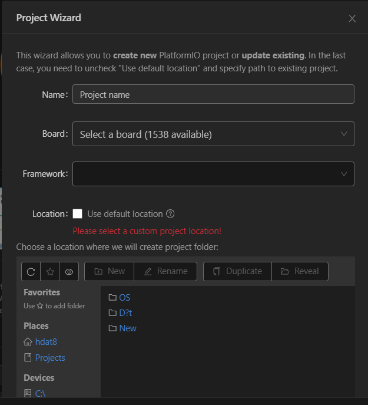
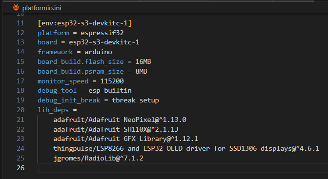

# Hướng dẫn ESP32-S3-DevKitC-1

## Giới thiệu

### Task
1. Sử dụng RGB LED tích hợp trên kit.
2. Sử dụng module OLED để hiển thị chữ.
3. Sử dụng module SX1280 để giao tiếp
truyền nhận dữ liệu không dây bằng công nghệ LoRa.

### Công cụ PlatformIO
1. [Cách tải PlatformIO và tạo Project](https://www.youtube.com/watch?v=1hKQPLwo6-8&ab_channel=GreenTechnology)
2. [Cách tải thư viện có sẵn](https://www.youtube.com/watch?v=unft_WOXkiI&ab_channel=GreenTechnology)
3. Cách build, nạp code.  

- Phím tắt build: Ctrl + Shift + B
- Phím tắt nạp: Ctrl + Shift + U
- Phím tắt Serial Monitor: Ctrl + Shift + S   
**Lưu Ý Khi Nạp Code:**
- Để vào chế độ nạp code, giữ nút **Boot** trên kit, sau đó nhấn nút **Reset**. Có thể cần thử vài lần để quen với thao tác này.
### Tạo Project
<p align="center">
     
</p>

- **Lựa chọn board:** Espressif ESP32-S3-DevKitC-1-N8 (8 MB QD, No PSRAM)
- **Framework:** Arduino
### Tham khảo
1. [ESP32-S3-DevKitC-1 User guide](https://docs.espressif.com/projects/esp-dev-kits/en/latest/esp32s3/esp32-s3-devkitc-1/user_guide_v1.0.html)
### Thư mục
- Task 1: `codeled.cpp`
- Task 2: `codeoled.cpp`
- Task 3: 
  - `receive.cpp` cho bên nhận
  - `transmit.cpp` cho bên truyền 
- Nơi nạp code chính: *src/main.cpp* 
- Thư viện: *.pio/libdeps*
## Task Report
### Thư viện
- Arduino.h   
- Wire.h   
- SSD1306Wire.h   
- RadioLib.h   
- Adafruit_NeoPixel.h   
### Cấu hình
<p align="center">
     
</p>

- Thông số của kit: Flash = 16MB, SRam = 8MB
- monitor_speed = 115200, số này **phải đồng bộ** với Serial.begin(115200) 

### TASK 1: Sử Dụng RGB LED Tích Hợp
RGB LED trên ESP32-S3-DevKitC-1 được điều khiển qua **chân số 48**, theo tài liệu của kit.

**Chi Tiết Thực Hiện:**
- **File**: `codeled.cpp`
- **Thư Viện**: `Adafruit_NeoPixel.h`
- **Các Bước**:
  1. Khai báo chân cho RGB LED.
  2. Thay đổi giá trị R, G, B để thay đổi màu sắc của LED. Có thể tham khảo các ở [ví dụ của thư viện](.pio/libdeps/esp32-s3-devkitc-1/Adafruit%20NeoPixel/examples/)
  ---

### TASK 2: Hiển Thị Chữ Trên Module OLED
Module OLED được giao tiếp bằng giao thức I2C để hiển thị chữ.

**Chi Tiết Thực Hiện:**
- **File**: `codeoled.cpp`
- **Thư Viện**: `SSD1306Wire.h`
- **Các Bước**:
  1. Khai báo các chân I2C cho module OLED.
  2. Sử dụng các hàm của thư viện `SSD1306Wire` để điều khiển hiển thị trên OLED. Có thể tham khảo các ở [ví dụ của thư viện](.pio/libdeps/esp32-s3-devkitc-1/ESP8266%20and%20ESP32%20OLED%20driver%20for%20SSD1306%20displays/examples/)
  ---

### TASK 3: Giao Tiếp Truyền Nhận Dữ Liệu Không Dây Với Module SX1280 (LoRa)
Module SX1280 được sử dụng để truyền và nhận dữ liệu không dây bằng công nghệ LoRa.

#### Thư viện chính: `RadioLib` 
- Tham khảo cách sử dụng ở [ví dụ của thư viện](.pio/libdeps/esp32-s3-devkitc-1/RadioLib/examples/SX128x/)
#### Khai Báo Chân, Cấu Hình RF
- Module mod(39, 42, 40, 41, SPI); //theo thứ tự chân NSS, DIO1, NRST, BUSY   
SX1280 radio(&mod);   
- ***Ở hàm void setup() phải có***
  - SPI.begin(36, 37, 35);
- `radio.begin(2450.0, 1625.0, 7, 5, 0x12, 2, 20);` theo thứ tự carrier_frequency = 2450.0;
bandwidth = 1625.0;
spreading_factor = 7;
coding_rate = 5;
sync_word = 0x12;
output_power = 2;
preamble_length = 20;   
Cấu hình để không giao tiếp nhầm cho thiết bị khác

#### Bên Nhận  
- Hàm chính `Recive()`

```Cpp
String Recive(){
  String msg;int len = 0;
  if(receivedFlag==1) {
    // reset flag
    receivedFlag = false;
    int state = radio.readData(msg);    
    if (state == RADIOLIB_ERR_NONE) {
      if(msg != "" ){
        Serial.println("Data received: " + msg);
        strip.setPixelColor(0, strip.Color(0, 255, 0)); // LED xanh
        strip.show();
        showOled(msg);        
        }        
        else{ 
          Serial.println("Data received: NONE" + msg);
          strip.setPixelColor(0, strip.Color(255, 0, 0)); // LED đỏ
          strip.show();
        }      
    }
    else if (state == RADIOLIB_ERR_CRC_MISMATCH) {
        // packet was received, but is malformed
        Serial.println(F("CRC error!"));
    } else {
      // some other error occurred
      Serial.print(F("failed, code "));
      Serial.println(state);
    }
    return msg; // trả về tin nhắn đã nhận
  }
  return ""; // nếu không có tin nhắn nào được nhận, trả về chuỗi rỗng
}
```
- `recievedFlag` ban đầu bằng false, sẽ được đặt bằng true nếu đã nhận được tin nhắn 
(xem hàm `SetFlag()`)
- Dùng `radio.readDatat(msg)` để lưu tin nhắn vào biến `msg`, nếu nhận được tin nhắn thì trả về msg,  nếu không có tin nhắn nào được nhận, trả về chuỗi rỗng.
- Nếu tin nhắn khác rỗng -> *led xanh*, nếu tin nhắn là rỗng -> *led đỏ*.
- Hàm `loop()`:
```cpp
void loop() {
  if(!mainFlag){
    Msg = Recive();
    if (Msg == " Hello")
      {
        mainFlag = true; //Nếu đã nhận được tin nhắn main, chuyển sang chế độ gửi "ACK"
      }
  }
  if (mainFlag){
    int state = radio.transmit("ACK");
    Serial.println("transmit again");
  }
}
```
- `mainFlag` ban đầu là `false` -> điều kiện !mainFlag = `true`
- Lưu tin nhắn nhận được vào Msg, nếu tin nhắn hợp lệ thì sẽ đặt `mainFlag` = true -> sẽ không vào được `if(!mainFlag)`.
- Sau đó sẽ liên tục gửi tin nhắn "ACK"
#### Bên gửi 
- Hàm chính `SendData()`
```cpp
void SendData(String data) {
  if(transmittedFlag) {
    // reset flag
    transmittedFlag = false;
    if (transmissionState == RADIOLIB_ERR_NONE) {
      // packet was successfully sent      
    } else {
      Serial.print(F("failed, code "));
      Serial.println(transmissionState);
    }
    radio.finishTransmit();     
    transmissionState = radio.startTransmit(data);

    if (transmissionState == RADIOLIB_ERR_NONE) {
      // packet was successfully sent
      Serial.println("[TX] Sending data. : " + data);
      Serial.println(F("transmission finished!"));
    } else {
      Serial.print(F("failed, code "));
      Serial.println(transmissionState);
  }
    strip.setPixelColor(0, strip.Color(255, 0, 0)); // LED đỏ
    strip.show();
  }
}
```
Tương tự với bên nhận transmittedFlag sẽ được đặt bằng `true` nếu bắt đầu gửi tin nhắn, tin nhắn được gửi khi gọi hàm `radio.startTransmit(data)`. Khi tin nhắn được gửi thành công thì *led xanh*.   
- **void loop()**    
Lập trình kiểu state machine
```cpp
void loop() {
  static long lastAction = 0;
  static String mainMsg = " Hello";
  static int retryCount = 0;
  switch (masterState) {
    case SEND_MAIN:
      static long lastAction1 = 0;
      if (!acktransmitFLag) {
        Serial.println("receivedFlag1 = " + String(receivedFlag));
        Serial.println("transmittedFlag1 = " + String(transmittedFlag));
        acktransmitFLag = true;
        radio.startTransmit(mainMsg);
        Serial.println("Sending main message: " + mainMsg);
      }
      static long lastAction2 = 0;
      if (millis() - lastAction2 >= 1500 && transmittedFlag) {
        lastAction2 = millis();
        masterState = WAIT_LISTEN_ACK;
        acktransmitFLag = false;
        transmittedFlag = false;
        radio.finishTransmit();
      }
      //Serial.println("Sending main message: " + mainMsg);
      strip.setPixelColor(0, strip.Color(255, 0, 0)); // LED đỏ
      strip.show();
      //chỉ để check lỗi
      static long lastAction8 = 0;
      if (millis() - lastAction8 >= 3000) {
        lastAction8 = millis();
        Serial.println("state = SEND_MAIN");
        Serial.println("receivedFlag = " + String(receivedFlag));
        Serial.println("transmittedFlag = " + String(transmittedFlag));
      }
      break;
    
    case WAIT_LISTEN_ACK:
        static long lastAction6 = 0;
        if (millis() - lastAction6 >= 3000) { // Đợi 2s
          lastAction6 = millis();
          Serial.println("state = WAIT_LISTEN_ACK");
        }
        static String str;
        radio.finishTransmit();
        state = radio.receive(str);
        if (state == RADIOLIB_ERR_NONE) {
          // packet was successfully received
          Serial.println(F("success!"));
          // print the data of the packet
          Serial.print(F("[SX1280] Data:\t\t"));
          Serial.println(str);
        } else if (state == RADIOLIB_ERR_RX_TIMEOUT) {
          // timeout occurred while waiting for a packet
          Serial.println(F("timeout!"));

        } else if (state == RADIOLIB_ERR_CRC_MISMATCH) {
          // packet was received, but is malformed
          Serial.println(F("CRC error!"));

        } else {
          // some other error occurred
          Serial.print(F("failed, code "));
          Serial.println(state);
        }
        if (str == "ACK") {
          Serial.println("[TX] Received ACK!");
          ackReceived = true;
          retryCount = 0;
          masterState = ACK_RECEIVED;
          break;
        }       
          
      break;
  
    case ACK_RECEIVED:
      strip.setPixelColor(0, strip.Color(0, 255, 0)); // LED xanh
      strip.show();
      static long lastAction7 = 0;
      if (millis() - lastAction7 >= 3000) { // Đợi 2s
        lastAction7 = millis();
        Serial.println("state = ACK_RECEIVED");
      }
      // Gửi lại dữ liệu
      break;
    //mấy case cũ đừng quan tâm
    case SEND_LISTEN:
      Serial.println("SEND_LISTEN");
      if(transmittedFlag){
        transmittedFlag = false;
        radio.finishTransmit();
        transmissionState = radio.startTransmit("need ACK2");
        masterState = WAIT_TRANSMIT_DONE;      
        Serial.println("send: need ACK");
      }
      static long lastAction3 = 0;
      if (millis() - lastAction3 >= 3000) { // Đợi 2s
        lastAction3 = millis();
        Serial.println("state = SEND_LISTEN");
      }
      break;
    case WAIT_TRANSMIT_DONE:
     Serial.println("WAIT_TRANSMIT_DONE");
      if (transmittedFlag) {
        transmittedFlag = false;
        radio.finishTransmit();
        masterState = WAIT_LISTEN_ACK;
      }
      static long lastAction5 = 0;
      if (millis() - lastAction5 >= 3000) { // Đợi 2s
        lastAction5 = millis();
        Serial.println("state = WAIT_TRANSMIT_DONE");
      }
      break;
  }
}
```
Chương trình được chia thành các trạng thái chính sử dụng `switch-case`, nhằm quản lý quá trình truyền – nhận và xác nhận dữ liệu qua LoRa (RadioLib), kết hợp điều khiển LED RGB để hiển thị trạng thái.
---

#### Biến liên quan

- `masterState`: biến điều khiển trạng thái chính (`SEND_MAIN`, `WAIT_LISTEN_ACK`, `ACK_RECEIVED`)
- `transmittedFlag`, `receivedFlag`: cờ báo trạng thái truyền và nhận dữ liệu
- `acktransmitFLag`: ngăn việc truyền nhiều lần khi đang ở trạng thái gửi
- `ackReceived`: xác nhận đã nhận được gói `"ACK"`
- `radio`: đối tượng LoRa (SX1280) dùng thư viện `RadioLib`
- `strip`: điều khiển LED RGB tích hợp
- `state`: biến kết quả trả về từ `radio.receive()`

---

### Mô tả chương trình
- Tiến hành gửi tin nhắn `mainMsg` 1 lần (*Nếu bên nhận chưa đọc được thì ấn nút boot lại*)
- Gửi xong thực hiện hoàn tất quá trình gửi bằng `radio.finishTransmit();`. Sau đó chuyển qua việc nhận ngay lập tức bằng `radio.receive(str);`.
- Nếu tin nhắn nhận được bằng `ACK` thì bật led xanh
- Hoàn tất Task.